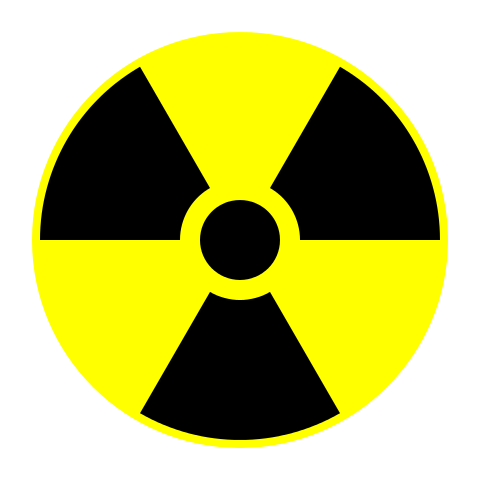

<center>
    
</center>

# babel-nuke
 A babel plugin for NukeJS.

# NukeJS
 NukeJs is an open source library that provides component oriented programming, JSX syntax and new features that we are working on

## Tutorial

### Comandos

* `npm start`: Inicia el proyecto en modo de desarrollo y habiolita un servidor para el proyecto

### Sintaxis basica

* Hola mundo

```js
Nuke.root(<div>Hola en Nuke JS</div>)
```

## How to use

In your `.babelrc`, enable the following plugin

```json
{
    "plugins": ["babel-plugin-nuke"]
}
```

### Authors

<a href="https://github.com/JudahAvadom">Judah</a>